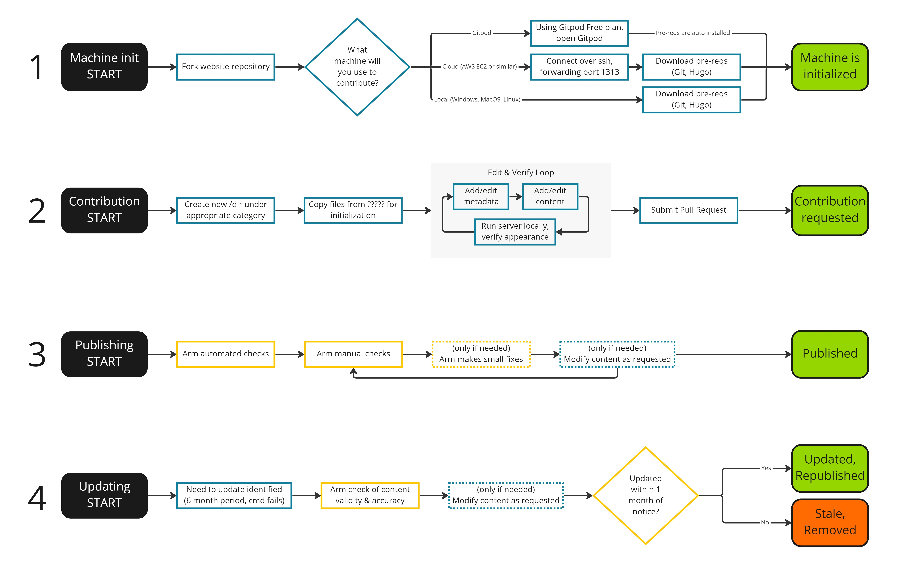

---
# User change
title: "Learning Path Overview"

weight: 2 # 1 is first, 2 is second, etc.

# Do not modify these elements
layout: "learningpathall"
---

## Why do Learning Paths exist?

Developers prefer different ways of learning. Learning Paths provide one way for developers to learn about Arm technology.

Ways of learning include:

* [Product Documentation and reference manuals](https://www.developer.arm.com/docs) are the trusted source of detailed information for developing on the Arm architecture.

* [Blogs](https://www.community.arm.com) offer news and announcements for recent and upcoming Arm activities.

* [Videos](https://www.youtube.com/c/armsoftwaredevelopers) provide talks and demos of Arm tools and other software topics.

* [Learning Paths](/) offer concise tutorials to achieve specific outcomes, and are supported by [tool install instructions](/install-tools/) to quickly learn how to install key Arm development tools.

## What is a Learning Path?

A Learning Path is ...
- a concise tutorial with detailed steps to learn how to complete a specific task
- always technical, relevant, and up-to-date
- easy to create using a GitHub-based contribution process

A Learning Path is not ...
- product documentation
- marketing material 
- product or developer news

## Where is the Learning Path source code?

Learning Paths are maintained in [GitHub](https://github.com/zachlas/arm-software-developers-ads). The content is written in markdown. [Hugo](https://gohugo.io/) is used to generate a static website from the markdown files.

## Who can write a Learning Path?

Anyone who wants to share Arm related software developer material can create a Learning Path.

## How can I write a Learning Path?

This Learning Path provides the needed information to create your own Learning Path. Please raise an issue on GitHub if you have questions or need help.

## When are Learning Paths reviewed and published?

Project maintainers will review and merge pull requests on a regular basis. 

<!-- numbered list is not indented -->
The complete process consists of four steps, all covered in this Learning Path:
- **Setup**: prepare required tools and setup GitHub repository
- **Contribute**: create new content and submit a pull request on GitHub
- **Publish**: work with project maintainer to resolve any feedback
- **Update**: keep the Learning Path up to date as things change

The four steps to create a Learning Path are shown in the diagram.

