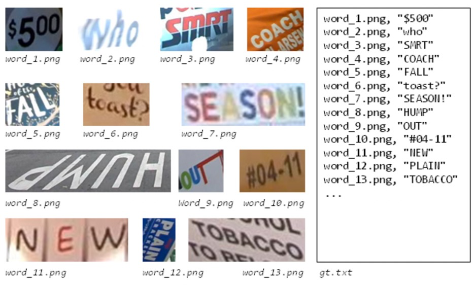

---
# User change
title: "Overview"

weight: 2 # 1 is first, 2 is second, etc.

# Do not modify these elements
layout: "learningpathall"
---

# Introduction
As one of the key applications in the field of Computer Vision (CV), Optical Character Recognition (OCR) aims at recognizing the text content of a fixed image area. OCR has been widely used in many industry scenarios such as card ticket information extraction and review, manufacturing product traceability, and electronic government medical document processing. Text recognition is a sub-task of OCR and it’s the next step after text detection in OCR’s two-stage algorithm, which can convert image information into text information. 

Figure 1. Example of English text recognition (Image source: [ICDAR2015](https://iapr.org/archives/icdar2015/index.html))

In this blog, we apply Deep Learning (DL) to the OCR text recognition task and show you an end-to-end development workflow all the way from model training to application deployment. You will learn how to:
- Use [PaddleOCR](https://github.com/PaddlePaddle/PaddleOCR) to obtain a trained English text recognition model
- Export the Paddle inference model 
- Compile the Paddle inference model with [TVMC](https://tvm.apache.org/docs/tutorial/tvmc_command_line_driver.html#sphx-glr-tutorial-tvmc-command-line-driver-py) for target device
- Build text recognition application and deploy it on the Arm Virtual Hardware [Corstone-300](https://www.arm.com/products/silicon-ip-subsystems/corstone-300) platform with [Arm Cortex-M55](https://www.arm.com/products/silicon-ip-cpu/cortex-m/cortex-m55).

This project highlights a collaboration between Arm and Baidu that fills a previous gap in the workflow of deploy a PaddlePaddle model directly to Arm Cortex-M. This increases the number of deep learning models supported on Cortex-M, thus providing developers with more choices.

