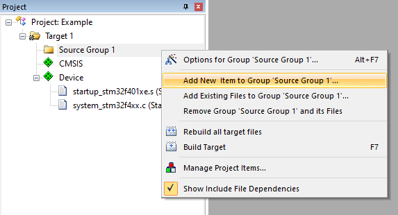
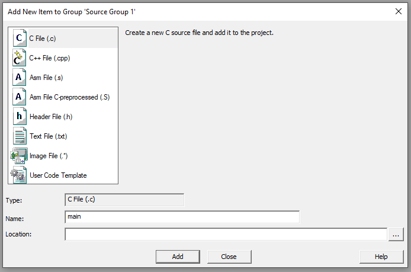

---
# User change
title: "Writing functions for string copy and string capitalize" 

weight: 4 # 1 is first, 2 is second, etc.

# Do not modify these elements
layout: "learningpathall"
---

We need to add a 'main.c' file to the source folder. To do this, right-click 'Source Group 1' > 'Add New Item'.



Select 'C file (.c)' and then name it 'main'. Choose an appropriate location to save it - such as the project folder.



Now let's populate it with some code.

## 5.1 Mixing Assembly Language and C Code

We will program the board in C, but add assembly language subroutines to perform the string copy and capitalization operations. Some embedded systems are coded purely in assembly language, but most are coded in C and resort to assembly language only for time-critical processing. This is because the code development process is much faster (and hence much less expensive) when writing in C when compared to assembly language. Writing an assembly language function which can be called as a C function results in a modular program which gives us the best of both worlds: the fast, modular development of C and the fast performance of assembly language. It is also possible to add inline assembly code to C code, but this requires much greater knowledge of how the compiler generates code.

## 5.2 The Main Function

First we will create the main C function. This function contains two variables (a and b) with character arrays.

```c
int main(void)
{
    const char a[] = "Hello world!";
    char b[20];

    my_strcpy(a, b);
    my_capitalize(b);

    while(1);
}
```

## 5.3 Register Use Conventions

There are certain register use conventions which we need to follow if we would like our assembly code to coexist with C code. We will examine these in more detail later in the module “C as implemented in Assembly Language”.

### 5.3.1 Calling Functions and Passing Arguments

When a function calls a subroutine, it places the return address in the link register lr. The arguments (if any)are passed in registers r0 through r3, starting with r0. If there are more than four arguments, or they are too large to fit in 32-bit registers, they are passed on the stack.

### 5.3.2 Temporary Storage

Registers r0 through r3 can be used for temporary storage if they were not used for arguments, or if the argument value is no longer needed.

### 5.3.3 Preserved Registers

Registers r4 through r11 must be preserved by a subroutine. If any must be used, they must be saved first and restored before returning. This is typically done by pushing them to and popping them from the stack.

### 5.3.4 Returning From Functions

Because the return address has been stored in the link register, the BX lr instruction will reload the pc with the return address value from the lr. If the function returns a value, it will be passed through register r0.

## 5.4 String Copy

The function my_strcpy has two arguments (src, dst). Each is a 32-bit long pointer to a character. In this case, a pointer fits into a register, so argument src is passed through register r0 and dst is passed through r1.

Our function will load a character from memory, save it into the destination pointer and increment both pointers until the end of the string.

```c
__attribute__((naked)) void my_strcpy(const char *src, char *dst)
{
    __asm(
        "loop: \n\t\
            LDRB  r2, [r0]  \n\t\
            ADDS  r0, #1    \n\t\
            STRB  r2, [r1]  \n\t\
            ADDS  r1, #1    \n\t\
            CMP   r2, #0    \n\t\
            BNE   loop      \n\t\
            BX    lr       \n\t\
    "    
    );
}
```

## 5.5 String Capitalization

Let’s look at a function to capitalize all the lower-case letters in the string. We need to load each character, check to see if it is a letter, and if so, capitalize it. 

Each character in the string is represented with its ASCII code. For example, ‘A’ is represented with a 65 (0x41), ‘B’ with 66 (0x42), and so on up to ‘Z’ which uses 90 (0x5a). The lower case letters start at ‘a’ (97, or 0x61) and end with ‘z’ (122, or 0x7a). We can convert a lower case letter to an upper case letter by subtracting 32. 

```c
__attribute__((naked)) void my_capitalize(char *str)
{
    __asm(
        "cap_loop: \n\t\
            LDRB  r1, [r0]   \n\t\
            CMP   r1, #'a'-1  \n\t\
            BLS   cap_skip   \n\t\
            CMP   r1, #'z'   \n\t\
            BHI   cap_skip   \n\t\
            SUBS  r1,#32     \n\t\
            STRB  r1, [r0]    \n\t\
        cap_skip:    \n\t\
            ADDS  r0, r0, #1  \n\t\
            CMP   r1, #0     \n\t\
            BNE   cap_loop   \n\t\
            BX    lr       \n\t\
        "    
    );
}
```

The code is shown above. It loads the byte into r1. If the byte is less than ‘a’ then the code skips the rest of the tests and proceeds to finish up the loop iteration. 

This code has a quirk – the first compare instruction compares r1 against the character immediately before ‘a’ in the table. Why? What we would like is to compare r1 against ‘a’ and then branch if it is lower. However, there is no branch lower instruction, just branch lower or same (BLS). To use that instruction, we need to reduce by one the value we compare r1 against.